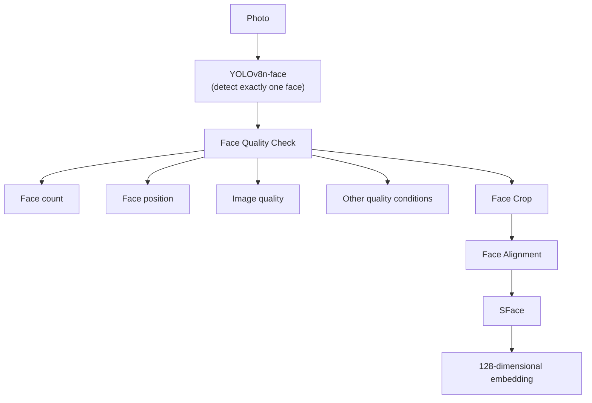
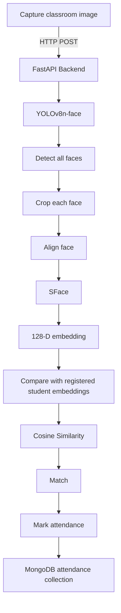

# Das Attendance System — How It Works & Face Recognition Plan

This document has two parts:

1. **Current state** — what exists in the repo today and how it actually works.
2. **Plan** — the simplest way to wire up real face-detection-based attendance, following the architecture already sketched in [`references/arch.jpeg`](Das-Attendence-System/references/arch.jpeg) and [`references/steps.jpeg`](Das-Attendence-System/references/steps.jpeg).

uvicorn app.main:app --reload

---

## 1. Current State

### 1.1 Stack

- **Backend**: FastAPI (`Backend/app`)
- **Database**: MongoDB, accessed with `pymongo` (sync) — `motor` (async) is installed but unused
- **Auth**: JWT (`python-jose`) + `bcrypt` password hashing
- **ML libraries already installed** (`Backend/requirements.txt`): `ultralytics` (YOLOv8), `insightface`, `onnxruntime`, `opencv-python`, `torch`/`torchvision`, `numpy` — these are installed but **not yet used anywhere in the code**. No detection or embedding-generation code exists yet.

### 1.2 Folder structure (relevant parts)

```
Das-Attendence-System/
├── main.py                    # stray root script — just prints library versions, not the real app
├── Src/detect.py              # empty
├── references/
│   ├── arch.jpeg              # enrollment pipeline diagram
│   └── steps.jpeg             # attendance/recognition pipeline diagram
└── Backend/
    ├── requirements.txt
    ├── app/
    │   ├── main.py             # FastAPI app entrypoint (currently broken, see 1.4)
    │   ├── config/database.py # Mongo connection + collection handles
    │   ├── models/             # plain Python classes with .to_dict()
    │   ├── schemas/            # Pydantic request/response models
    │   ├── routes/             # FastAPI routers (HTTP layer)
    │   └── services/           # DB logic called by routes
```

### 1.3 What's implemented today

Everything implemented so far is **plain CRUD over MongoDB** — there is no computer vision happening anywhere yet.

| Domain | Route file | Service file | Collection | Status |
|---|---|---|---|---|
| Auth | `routes/auth.py` | `services/auth_service.py` | `users` | Working — register/login, JWT, bcrypt |
| Students | `routes/students.py` | `services/student_service.py` | `students` | Working CRUD |
| Faculty | `routes/faculty.py` | `services/faculty_service.py` | `faculty` | Working CRUD |
| Subjects | `routes/subjects.py` | `services/subject_service.py` | `subjects` | Working CRUD |
| Face embeddings | `routes/face.py` | `services/face_service.py` | `face_embeddings` | Working CRUD, **but** it only stores/reads a vector the *caller* already computed — `POST /faces/` expects the client to send `embedding_vector: List[float]` directly. There is no code that turns a photo into that vector. |
| Attendance records | `models/attendance_record.py`, `schemas/attendence.py` exist | `services/attendance_service.py` | `attendance_records` | **Not implemented.** The service file is empty and no router is wired up. Data shape is designed (`record_id`, `student_id`, `subject_code`, `session_id`, `is_present`, `marked_by`, `timestamp`) but nothing writes to this collection. |
| Capture sessions | `models/capture_session.py`, `schemas/session.py` exist | — | `capture_sessions` | Same as above — schema exists, no service/route. |

Request flow for the parts that do work, e.g. creating a student:

```
Client → POST /students/  (StudentCreate)
       → routes/students.py: create()
       → services/student_service.py: create_student()
       → app/config/database.py: students.insert_one(...)
       → MongoDB
```

The face-embedding CRUD (`routes/face.py` → `services/face_service.py`) follows the identical pattern against the `face_embeddings` collection, storing `{student_id, embedding_vector, model_name, photo_count, created_at}`.

### 1.4 Known issues in the current code

Worth knowing before building on top of this:

- **`Backend/app/main.py` is corrupted** — it looks like two versions of the file got pasted together. It defines `app = FastAPI(...)` twice and has an orphaned second block (duplicate imports, a second `home()` route, a second `app.include_router(auth_router)`) sitting after the `if __name__ == "__main__":` block, which makes it dead code that never executes anyway. The app *may* still boot because the first `app` object silently gets the routers from the *bottom* of the file (`auth_router`, `student_router`, `faculty_router`, `subject_router`, `face_router` are included at module scope, so they do attach) — but the file needs a cleanup pass to actually reflect one coherent app.
- **`routes/recognition.py` and `routes/attendence.py` are dead/broken legacy files.** They import from paths that don't exist in this project (`from services.face_service import ...`, `from database import get_db` — should be `app.services...`, `app.config.database`) and call functions (`register_face(image, user, db)`, `recognize_face(image, db, class_id)`) that don't exist in the current `face_service.py`. They are **not** included in `app/main.py`'s routers, so they don't run — but they're misleading if you go looking for "where attendance marking happens." Safe to delete once the new endpoints in the plan below replace them.
- **`app/config/database.py`** calls `os.getenv("mongodb://127.0.0.1:27017/attendance_db")` and `os.getenv("face_attendance_system")` — those strings are being passed as *environment variable names*, not defaults, so both calls just return `None` and are unused. The actual connection uses the hardcoded string on the next line, so it still works today, but the `.env` file isn't actually being read. Should be `os.getenv("MONGODB_URL", "mongodb://127.0.0.1:27017/attendance_db")`.
- **`Backend/requirements.txt` is UTF-16 encoded** with a stray BOM — it reads as readable text in an editor but tools expecting UTF-8 (`pip install -r requirements.txt` is fine since pip tolerates it, but diff tools/linters may render it oddly). Not urgent, just noted.
- **Root `main.py` and `Src/detect.py`** are scratch/exploratory files (version-printing, empty file) — not part of the real backend at `Backend/app/main.py`.

---

## 2. Planned Face Recognition Pipeline

This is the architecture already agreed in the two reference images. Reproduced here as text/diagrams so it lives in the repo alongside the code.

### 2.1 Enrollment pipeline (`references/arch.jpeg`) — run once per student



The quality check exists to reject bad enrollment photos up front (no face, multiple faces, face too close to the edge, blurry/dark image) — enrollment is the one place it's worth being strict, since a bad reference embedding poisons every future match against that student.

### 2.2 Attendance pipeline (`references/steps.jpeg`) — run per classroom capture



Same building blocks as enrollment (detect → crop → align → SFace), just run once *per face found* in a group photo, then each resulting embedding is matched against every stored student embedding instead of being stored itself.

---

## 3. Implementation Plan — simplest working version

Goal: get a real photo in, and a real attendance row in MongoDB out, with the least new machinery. This reuses the existing CRUD scaffolding as much as possible instead of building a parallel system.

### 3.1 Model choices (simplest option for each stage)

| Stage | Choice | Why this is the simple option |
|---|---|---|
| Detection | YOLOv8n-face weights loaded via `ultralytics.YOLO(...)`, already installed | `ultralytics` is already a dependency; only new work is obtaining a face-trained `.pt` file (the stock `yolov8n.pt` is COCO/person, not face-specific — search GitHub/HuggingFace for a WIDERFace-trained "yolov8n-face" checkpoint and drop it in `Backend/app/ml_models/`) |
| Face crop → alignment | **Bounding-box crop + resize to 112×112, no geometric warp** | True 5-point landmark alignment needs a YOLO variant that also outputs eye/nose/mouth keypoints, plus extra warp-affine math. For an educational project with reasonably front-facing photos, a straight crop+resize is good enough and removes an entire failure mode (landmark ordering bugs). Documented as a Phase 2 upgrade below. |
| Embedding | `cv2.FaceRecognizerSF` (OpenCV's built-in SFace wrapper — part of plain `opencv-python`, no extra install) loaded with the public `face_recognition_sface_2021dec.onnx` weights (from the OpenCV Zoo project) | Zero glue code: `recognizer.feature(aligned_face)` gives the 128-d vector directly, and `recognizer.match(feat1, feat2, cv2.FaceRecognizerSF_FR_COSINE)` gives cosine similarity for free — no manual numpy cosine-similarity function needed |
| Matching | Linear scan: fetch all stored embeddings (`get_all_faces()` already exists), compute cosine similarity against each, keep best match above a threshold (start at `0.45`, OpenCV's own suggested SFace threshold) | Class sizes are small (tens–hundreds of students); no need for a vector index / ANN library |

`insightface` (also installed) is a reasonable alternative since it can run detection+recognition in one call, but it pulls in its own detector (RetinaFace/SCRFD) instead of the YOLOv8n-face the diagrams call for — sticking to `ultralytics` + `cv2.FaceRecognizerSF` matches the agreed diagrams with the fewest moving parts.

### 3.2 New/changed files

```
Backend/app/ml_models/                      # new — weight files, gitignored
    yolov8n-face.pt
    face_recognition_sface_2021dec.onnx

Backend/app/services/recognition_service.py # new — the only real "CV" code in the project
    - load_models()            # called once at startup, caches YOLO + SFace in module-level globals
    - detect_faces(image)      # -> list of bounding boxes
    - get_embedding(face_crop) # -> 128-d vector via cv2.FaceRecognizerSF
    - cosine_match(vector, all_faces, threshold=0.45) # -> best (student_id, score) or None

Backend/app/routes/face.py                   # add one endpoint
    POST /faces/enroll        # multipart image + student_id -> runs arch.jpeg pipeline -> calls existing register_face()

Backend/app/services/attendance_service.py   # currently empty — implement
    create_attendance_record(data)
    get_records_for_session(session_id)

Backend/app/routes/attendance.py             # new — replaces the dead attendence.py
    POST /attendance/mark     # multipart classroom image + subject_code + session_id
                              # -> runs steps.jpeg pipeline for every detected face
                              # -> for each match, calls create_attendance_record()
                              # -> returns list of {student_id, matched, score}

Backend/app/main.py                          # fix duplication (1.4), register the new attendance router,
                                              # call recognition_service.load_models() on startup

Backend/app/routes/recognition.py            # delete — superseded by /faces/enroll
Backend/app/routes/attendence.py             # delete — superseded by /attendance/mark
```

### 3.3 Endpoint behavior

**`POST /faces/enroll`** (student enrollment)
1. Accept `student_id` + an uploaded image file.
2. Run YOLOv8n-face detection. If face count != 1 → `400 Bad Request` ("expected exactly one face, found N").
3. Crop the detected box, resize to 112×112.
4. `cv2.FaceRecognizerSF.feature(...)` → 128-d vector.
5. Call the **existing** `register_face()` from `face_service.py` with that vector — no changes needed there.

**`POST /attendance/mark`** (classroom capture)
1. Accept `subject_code`, `session_id`, `marked_by`, and an uploaded classroom image.
2. Run YOLOv8n-face detection → list of boxes (can be many faces).
3. For each box: crop, resize, embed (same 4 steps as enrollment, minus the "exactly one face" rule).
4. Fetch all stored embeddings once via `get_all_faces()`.
5. For each detected embedding, compute cosine similarity against every stored one, keep the best match if it's above the threshold.
6. For every matched student, build an `AttendanceRecord(is_present=True, ...)` and insert into `attendance_records` via the new `create_attendance_record()`.
7. Return a summary: which students were matched, and their similarity scores (useful for debugging threshold choice in an educational setting).

### 3.4 Explicitly cut for simplicity (call these out as "future work", don't build them now)

- No real 5-point landmark alignment (see 3.1) — revisit only if raw crop+resize gives poor accuracy in testing.
- No liveness/anti-spoofing (photo-of-a-photo protection) — out of scope for an educational demo.
- No multi-frame voting / video stream — one still image in, one attendance pass out.
- No async/`motor` — keep using the existing sync `pymongo` calls already used everywhere else in the codebase for consistency.
- No vector index (FAISS/pgvector/etc.) — linear scan is fine at this scale.
- No de-duplication across repeated `/attendance/mark` calls in the same session — if this matters later, add a uniqueness check on `(student_id, session_id)` before inserting.

### 3.5 Suggested build order

1. Fix `Backend/app/main.py` (dedupe) and the `database.py` `getenv` calls — quick correctness pass, unblocks everything else.
2. Delete the dead `recognition.py` / `attendence.py`.
3. Download the two weight files into `Backend/app/ml_models/` (gitignore that folder — weights don't belong in git).
4. Write `recognition_service.py` and unit-test it standalone (script that loads one photo, prints the embedding) before wiring it into any route.
5. Add `POST /faces/enroll`, test by enrolling 2–3 students with real photos.
6. Implement `attendance_service.py` + add `POST /attendance/mark`, test with a group photo containing enrolled + unenrolled faces, confirm matches and threshold behavior.
7. Sanity-check `attendance_records` in MongoDB after a real request.

### 3.6 Why this reuses so much existing code

The DB schema (`face_embeddings` collection, `AttendanceRecord` model, `AttendanceCreate` schema) was already designed correctly for this — the gap was purely "nothing computes a real embedding from a photo, and nothing writes to `attendance_records`." This plan adds exactly those two things and leaves the rest of the CRUD layer (students/faculty/subjects/auth) untouched.

---

## 4. End-to-end: faculty logs in → opens the camera → attendance gets recorded

Section 3 covers the CV pipeline in isolation. This section wires it to an actual faculty account, because "logged-in faculty member" and "which class is this photo for" don't exist as concepts anywhere in the backend yet.

### 4.1 What already exists for this specific flow

There's a full **React frontend** at `Das-Attendence-System/attendsys/` (Vite + React Router) that most people wouldn't expect to find — it's already built end-to-end as a *demo* against mock data, with the exact backend contract it expects written as comments in the code:

- [`attendsys/src/components/CameraCapture.jsx`](Das-Attendence-System/attendsys/src/components/CameraCapture.jsx) — already opens the device camera and turns a snapshot into a `Blob`. **Nothing to build here.**
- [`attendsys/src/pages/faculty/FacultyLiveSession.jsx`](Das-Attendence-System/attendsys/src/pages/faculty/FacultyLiveSession.jsx) — the faculty dashboard's main page. Calls `api.getActiveSession()`, `api.getRoster()`, `api.triggerCapture(photo)` — all currently mocked, all commented with the real route each should hit.
- [`attendsys/src/services/api.js`](Das-Attendence-System/attendsys/src/services/api.js) — the *only* file that's supposed to talk to the backend. Every function is a `mock(...)` call today with the real endpoint written next to it as a comment.
- [`attendsys/src/context/AuthContext.jsx`](Das-Attendence-System/attendsys/src/context/AuthContext.jsx) + [`attendsys/src/components/LoginForm.jsx`](Das-Attendence-System/attendsys/src/components/LoginForm.jsx) — login form already collects email/password, but `handleSubmit` ignores them and fakes a login (`login(role, demoName)`).

So the frontend is not the blocker — it's a wiring job. The blocker is that the **backend has no idea what a "faculty" or "live class session" is at request time**: `POST /auth/login` returns a token with `user_id`/`email`/`role` only, there's no endpoint that says "this faculty's class right now is Section A, Subject CS101", and nothing in `attendance_records` gets written by anything.

### 4.2 The missing concept: a "live session"

`face_embeddings`, `students`, `attendance_records` already exist correctly. What's missing is the thing `session_id` on `AttendanceRecord` is supposed to point to: *"Prof. Karki started a class for CS101 at 10:05am, capture photos against this session until they end it."*

Simplest option: reuse the already-defined `capture_sessions` collection (`models/capture_session.py` / `schemas/session.py` already exist) and add one field, `status: "active" | "closed"`. No new collection needed.

### 4.3 Step-by-step changes

#### A. Backend — know who's logged in, and that they're faculty

1. **`Backend/app/utils/jwt_handler.py`** — add two FastAPI dependencies:
   - `get_current_user(token: str = Depends(oauth2_scheme))` → calls the existing `verify_token()`, raises `401` if it returns `None`, otherwise returns the decoded payload (`user_id`, `email`, `role`).
   - `require_role(role: str)` → a dependency factory that reuses `get_current_user` and raises `403` if `payload["role"] != role`. This is what protects every faculty-only route below.
2. **`Backend/app/services/faculty_service.py`** — add `get_faculty_by_user_id(user_id)`, same one-line pattern as the existing `get_faculty(faculty_id)`, just querying `{"user_id": user_id}` instead.
3. **`Backend/app/services/auth_service.py`** (`login_user`) — after verifying the password, if `user["role"] == "faculty"`, call the new `get_faculty_by_user_id()` and add `faculty_id` to the JWT payload passed into `create_access_token(...)`.
4. **`Backend/app/routes/auth.py`** (`login`) — also return `faculty_id` (and `role`, `fullname`) in the JSON response body, not just the token. This matches what `AuthContext.jsx`'s own TODO comment already expects: `const { access_token, role, name } = await res.json();` — just add `faculty_id` to that destructure. Doing it this way means the frontend never needs a second round-trip just to find out which faculty is logged in.

#### B. Backend — give a faculty account something to capture against

5. **`Backend/app/schemas/session.py`** — add `SessionStart` (`{subject_code: str}`) — the faculty picks a subject they're about to teach; `faculty_id` comes from the JWT (`Depends(require_role("faculty"))`), not the request body.
6. **`Backend/app/services/session_service.py`** *(new file)*:
   - `start_session(faculty_id, subject_code)` — generates a `session_id` (`str(uuid.uuid4())`), inserts into `capture_sessions` with `status="active"`, `frames_captured=0`, `total_recognized=0`.
   - `get_active_session(faculty_id)` — `capture_sessions.find_one({"faculty_id": faculty_id, "status": "active"})`.
   - `end_session(session_id)` — `$set`s `status="closed"`.
7. **`Backend/app/routes/sessions.py`** *(new file, prefix `/faculty`, all routes behind `Depends(require_role("faculty"))`)*:
   - `POST /faculty/sessions/start` → `SessionStart` body → calls `start_session`.
   - `GET /faculty/sessions/active` → calls `get_active_session`. This is the exact route `api.getActiveSession()` already expects (per its comment).
   - `POST /faculty/sessions/{id}/end` → calls `end_session`.

#### C. Backend — the actual computer vision + attendance writing

8. Build **`Backend/app/services/recognition_service.py`** exactly as scoped in Section 3.2/3.3 (`load_models`, `detect_faces`, `get_embedding`, `cosine_match`). This is the one genuinely new piece of ML code in the whole project.
9. Fill in **`Backend/app/services/attendance_service.py`** (currently empty):
   - `mark_attendance(session_id, subject_code, student_id, marked_by)` — insert into `attendance_records`, but first check `find_one({"session_id": session_id, "student_id": student_id})` so re-running capture on the same session doesn't create duplicate rows for a student already marked present.
   - `get_roster(session_id, subject_code)` — read the full student list for that subject (`students.find(...)`, filtered by section/semester as appropriate) **left-joined** against `attendance_records` for this `session_id`, so students who were never matched show up as `absent` instead of just not appearing. This is what drives the "Roll call override" table in `FacultyLiveSession.jsx`.
   - `override_attendance(record_id, is_present)` — simple `$set`, for the manual roll-call correction button.
10. **`Backend/app/routes/sessions.py`** — add `POST /faculty/sessions/{id}/capture`:
    - Accepts a multipart `image: UploadFile`.
    - Runs `detect_faces()` → for each detected face, `get_embedding()` → `cosine_match()` against every enrolled student (`face_service.get_all_faces()`).
    - For each match above the threshold, calls `mark_attendance(session_id, subject_code, student_id, marked_by=faculty_id)`.
    - Updates the session doc's `frames_captured` (+1) and `total_recognized` (+matches found).
    - Returns `{"detected": N, "matched": M}` — this is the literal shape `api.triggerCapture()`'s comment already expects.
11. **`Backend/app/routes/sessions.py`** — add `GET /faculty/sessions/{id}/roster` (calls `get_roster`) and a small **`Backend/app/routes/attendance.py`** with `PATCH /attendance/{record_id}` (calls `override_attendance`) — these back `api.getRoster()` and `api.overrideAttendance()`.
12. Optional, can be skipped for a first pass: `GET /faculty/alerts` — loop over a faculty's students, count `attendance_records` per subject, flag anyone under 75%. A plain Python loop over already-fetched documents is fine at this scale; no aggregation pipeline needed for an educational project.

#### D. Backend — wire it all together

13. Fix **`Backend/app/main.py`**'s duplication bug (see §1.4) as part of this work, since you're touching this file anyway — then add `app.include_router(session_router)` and `app.include_router(attendance_router)`.
14. Add a startup hook so the models load once, not on every request:
    ```python
    @app.on_event("startup")
    def _load_models():
        recognition_service.load_models()
    ```

#### E. Frontend — real login

15. **`attendsys/src/services/api.js`** — implement `login(email, password)` for real (`POST /auth/login`), and add the `authHeader(token)` helper the file's own header comment already sketches.
16. **`attendsys/src/context/AuthContext.jsx`** — replace the demo `login(role, name)` body with the real version already written in its own comment block: call `api.login`, store `access_token` + `faculty_id` in state (`sessionStorage` is a reasonable next step so a page refresh doesn't force re-login, as its TODO already notes).
17. **`attendsys/src/components/LoginForm.jsx`** — in `handleSubmit`, replace `login(role, demoName); navigate(redirectTo);` with the fetch already written in its own TODO comment, passing the real `email`/`password` state that the form already collects (it's currently collected and then ignored).

#### F. Frontend — real session + real capture

18. **`FacultyLiveSession.jsx`** — on mount, call the now-real `api.getActiveSession()`. If there is none, show a small "start class" control (pick a subject from the faculty's `subjects_assigned`, call a new `api.startSession(subjectCode)` → `POST /faculty/sessions/start`) before the camera/capture UI is usable. Store the returned `session_id` in state.
19. **`runCapture()`** in the same file — implement exactly the `FormData` + `fetch` block already written in its own comment, POSTing to `/faculty/sessions/${session_id}/capture` with `photoShots[0]` as the `image` field, then re-fetch the roster.
20. Wire `getRoster`, `overrideAttendance`, `getLowAttendanceAlerts` in `api.js` to the real routes from step C, following the exact fetch pattern already used by `getFacultyStudents()` (the one function in `api.js` that's already real — copy its shape).

### 4.4 Suggested build/test order

1. A → run one `curl` login as a faculty account, confirm `faculty_id` comes back.
2. B → start a session, confirm `GET /faculty/sessions/active` returns it.
3. C, tested standalone first (a script that loads a photo and prints matches) before wiring into the route — same advice as Section 3.5.
4. C wired into `/faculty/sessions/{id}/capture`, tested with `curl -F "image=@classroom.jpg"` before touching the frontend at all.
5. E, then F — only connect the UI once the backend routes already work from the command line. This avoids debugging the camera/React layer and the model at the same time.

---

## 5. What's actually implemented right now

Section 3/4 above were the plan. This section is the part of it that's actually been built, kept intentionally minimal — it stops at "the backend can really turn a photo into an attendance row," and does **not** yet include the faculty-login/session machinery from Section 4 (no `require_role`, no `/faculty/sessions/...` — those are still future work).

### 5.1 Model choice actually used: OpenCV YuNet + SFace, not YOLOv8n-face

Section 3 originally scoped YOLOv8n-face for detection. In practice, **OpenCV's built-in YuNet detector** was used instead of YOLOv8n-face — confirmed with you directly before building, since it's a real deviation from `references/arch.jpeg`/`steps.jpeg`. Reasoning: both YuNet and SFace are tiny ONNX models loaded through `cv2.FaceDetectorYN`/`cv2.FaceRecognizerSF`, which already ship inside the installed `opencv-python` (no new pip packages), and YuNet's detection output plugs directly into `recognizer.alignCrop(...)`, so proper 5-point landmark alignment is one function call instead of custom warp-affine math. SFace, the 128-d embedding, and cosine-similarity matching are all exactly as planned.

The two model files live in **`Backend/app/ml_models/`** (gitignored — they're binaries, ~39MB combined, fetched from the `opencv/opencv_zoo` GitHub repo):
- `face_detection_yunet_2023mar.onnx`
- `face_recognition_sface_2021dec.onnx`

If this machine's copy is ever wiped, re-fetch them from `opencv/opencv_zoo` (`models/face_detection_yunet/` and `models/face_recognition_sface/` — note: GitHub's raw URLs serve LFS *pointer* files for these, not the actual bytes; use `media.githubusercontent.com/media/...` instead of `raw.githubusercontent.com/...` to get the real binary).

### 5.2 New/changed files

| File | Change |
|---|---|
| `Backend/app/services/recognition_service.py` | **New.** `load_models()`, `extract_single_embedding(image_bytes)` (enrollment — errors unless exactly one face), `extract_all_embeddings(image_bytes)` (attendance — one feature vector per detected face), `find_best_match(embedding, stored_faces, threshold=0.363)` (linear cosine-similarity scan, `0.363` is OpenCV Zoo's documented SFace threshold). |
| `Backend/app/services/attendance_service.py` | Was empty. Now has `mark_attendance(student_id, subject_code, session_id, marked_by)` (skips if that student already has a record for that session — capture can be re-run without duplicating rows) and `get_records(session_id)`. |
| `Backend/app/routes/face.py` | Added `POST /faces/enroll` (multipart `student_id` + `image`) — runs `extract_single_embedding`, then calls the **existing, untouched** `register_face()`. |
| `Backend/app/routes/attendance.py` | **New**, replacing the dead `attendence.py`/`recognition.py`. `POST /attendance/mark` (multipart `subject_code` + `session_id` + `marked_by` + `image`) runs `extract_all_embeddings` → `find_best_match` per face → `mark_attendance` per match → returns `{detected, matched, matches}`. `GET /attendance/{session_id}` lists that session's records. |
| `Backend/app/routes/recognition.py`, `Backend/app/routes/attendence.py` | **Deleted** — dead legacy files (§1.4), never wired into `main.py`, superseded by the file above. |
| `Backend/app/main.py` | De-duplicated (§1.4) — one `FastAPI()` instance, CORS actually applies to the app that's really running now. Added `attendance_router`. Model loading moved to a `lifespan` handler (`on_event("startup")` is deprecated) so YuNet/SFace load once at boot. |
| `Backend/app/config/database.py` | Fixed the `os.getenv(...)` bug (§1.4) — `MONGO_URI`/`DB_NAME` are now actually read from `.env` instead of being silently ignored. |
| `Backend/app/ml_models/` | **New folder** — the two `.onnx` weight files + a `.gitignore` so they don't get committed. |

**Heads up on a real behavior change**: fixing `database.py` means the app now connects to whatever `.env` says (`DB_NAME=attendance_system`) instead of the old hardcoded-but-dead `face_attendance_system`. If any manual testing already put data in `face_attendance_system` via a Mongo shell, it's now in a different database than the one the app reads.

### 5.3 What this deliberately does not include yet

Kept out on purpose, to match "minimal changes" — these are still exactly what Section 4 describes as future work:

- No login/session requirement on these two endpoints — `subject_code`, `session_id`, `marked_by` are passed straight in the request, not derived from a JWT or an active-session lookup.
- No `sessions`/`capture_sessions` bookkeeping (`frames_captured`, `total_recognized` are never incremented).
- No roster/absentee computation — `GET /attendance/{session_id}` only returns students who *were* matched, not the full class with absentees filled in.
- No face-quality checks beyond "exactly one face" on enrollment (no position/blur/lighting checks).
- The React frontend (`attendsys/`) is still fully on mock data — untouched by this pass. *(No longer true — see Section 6, where it was wired up.)*

### 5.4 Verified working end-to-end

Ran directly against a live `uvicorn` instance and a local MongoDB, using a real cropped face photo (not synthetic):
1. `POST /faces/enroll` with one face → `201`, embedding stored.
2. `POST /attendance/mark` with the same face → `detected: 1, matched: 1, score: 1.0`, and the row showed up via `GET /attendance/{session_id}`.
3. Re-running step 2 did **not** create a second record (duplicate guard confirmed).
4. `POST /faces/enroll` with a 16-face crowd photo correctly rejected with `400 Expected exactly one face, found 16`.

All test documents were deleted afterward — nothing from this smoke test is left in the database.

---

## 6. Frontend connected: login, enrollment, attendance capture, student view

This pass wired the already-built React frontend (`attendsys/`) to the real backend for the four things that matter to actually use the system: logging in as any role, an admin enrolling a student's face, a faculty member capturing attendance, and a student viewing their own attendance. It deliberately does **not** add the auth/session hardening described in Section 4 (still future work) — routes remain unprotected server-side, gated only by client-side routing, same as before.

### 6.1 Login, and where accounts come from

`users` is the one and only login table — a student login and a faculty login are both just a `users` document with `role: "student"` / `role: "faculty"`; an admin is a `users` document with `role: "admin"`. There's no separate "admins" collection.

Since there was no way to create a faculty/student account with credentials in one step, **creating a student or faculty record now also creates its login account**:

- `student_service.create_student()` / `faculty_service.create_faculty()` each now also insert a `users` document, with a **default password of `{student_id}@123` / `{faculty_id}@123`**, and link it via `user_id` on the profile doc (exactly the `user_id` field that already existed on both models, previously always `None` since nothing set it).
- The default password is returned once, in the create-response JSON (`default_password`) — it's a bcrypt hash in the database from that point on, so this is the only time it's ever visible. The admin UI (`AdminEnrollment.jsx`'s student form, `AdminUsers.jsx`'s new faculty form) shows it in a banner right after creation.
- `POST /auth/register` (used to bootstrap the *first* admin account) is untouched and still completely open — anyone can hit it and register as any role, including `admin`. This was already true before this pass; still an open gap, still deferred to Section 4's role-guard work.
- `auth_service.login_user()` now looks up the caller's profile after verifying the password — a student's `student_id`, or a faculty's `faculty_id` + `subjects_assigned` — and returns it directly in the login response (and inside the JWT), so the frontend never needs a second round-trip to find out "which student/faculty is this."

### 6.2 Admin: creating accounts and enrolling faces

- **`AdminEnrollment.jsx`**'s "Add new student" form now collects exactly what `StudentCreate` needs (`student_id`, `fullname`, `email`, `section`, `semester`, `address` — it previously collected `name`/`roll`/`program`, none of which matched the backend schema) and posts to the real `POST /students/`.
- Its face-capture step now takes **one** photo instead of 10–20 — `POST /faces/enroll` computes one embedding per exactly-one-face photo; there's no multi-photo averaging in this backend (see Section 3.1's simplicity tradeoff). `CameraCapture`'s `maxShots` was turned down from `20` to `1` accordingly.
- The enrollment queue (`getEnrollmentQueue`) is computed client-side as a set difference: every student from `GET /students/` whose `student_id` doesn't appear in `GET /faces/`'s list. There's no `embedding` field on the student document to check directly (embeddings live in their own collection).
- **`AdminUsers.jsx`** gained a small "+ Add faculty" form (nothing existed for this before), posting to `POST /faculty/`, showing the generated default password the same way.

### 6.3 Faculty: capturing attendance

There's still no "session" concept server-side (Section 4's `capture_sessions.status` idea wasn't built). Instead, **`FacultyLiveSession.jsx`** now:
- Loads the faculty's own subjects (`GET /subjects/`, filtered client-side to the `subject_code`s in `subjects_assigned` from login) and lets them pick one if they teach more than one.
- Derives `session_id` as `` `${subjectCode}_${today's date}` `` — deterministic, so capturing twice for the same subject on the same day adds to one session (no duplicate attendance rows, per the existing guard in `mark_attendance`) instead of starting a new one each time.
- `runCapture()` now does a real multipart `POST /attendance/mark` with that `subject_code`/`session_id` and `marked_by: facultyId`, and shows the real `{detected, matched}` counts back.
- The roster card now reads real data from `GET /attendance/{session_id}`, joined against `GET /students/` for display names — it only ever shows matched (present) students, per the same limitation noted in §5.3. The manual roll-call toggle button is still local-state-only (no `PATCH /attendance/{record_id}` exists yet); flagged again here since it's easy to mistake for something persisted.

### 6.4 A gap this surfaced: "held" sessions weren't tracked anywhere

Giving a student a real attendance percentage needs to know how many classes were *held*, not just how many they attended — and nothing recorded that; `attendance_records` only ever gets a row when a face matches, so there was no way to know a session happened at all if a given student wasn't in it.

Fixed by finally using the `capture_sessions` collection, which existed (model, schema) but was **never written to** until now:

- `attendance_service.log_session()` — called once per `/attendance/mark` request — inserts a `capture_sessions` document keyed by `session_id` the first time it's seen for that subject, or increments its `frames_captured`/`total_recognized` counters on repeat captures.
- `attendance_service.get_student_summary(student_id)` (backing the new `GET /attendance/student/{student_id}/summary`) computes, per subject the student has at least one record in: `held = capture_sessions.count_documents({subject_code})`, `attended` = their own record count for that subject, `absent = held - attended`, `pct = attended/held`.
- **Known limitation** carried over from this approach: a subject the student has *zero* attendance rows for (fully absent, every time) won't appear in `subjects` at all, since the summary only iterates subject codes it finds in the student's own records. Good enough for a first pass; a true fix means iterating every subject the student is enrolled in, not just the ones they have rows for — not built, since there's no formal student↔subject enrollment link in the data model yet.
- Also added: `AttendanceRecord.confidence` (the cosine-similarity score at match time) — a small additive field, stored on every new attendance row and surfaced in the student's history table and "last recognized scan" card. Existing rows created before this change simply don't have it (`None`).

### 6.5 Student: viewing their own attendance

`StudentOverview.jsx` and `StudentHistory.jsx` now call the new summary endpoint (via `api.getStudentProfile`/`getStudentSubjects`/`getStudentHeatmap`/`getStudentHistory`, all reshaping the same underlying `GET /attendance/student/{id}/summary` payload, joined against `GET /subjects/` for real subject names instead of codes). The 14-day heatmap and the history table are both derived client-side from the same raw record list — no separate backend endpoint for either.

One honest data-model consequence worth remembering: since `attendance_records` never stores an explicit "absent" row (only present rows are ever written — see §6.4), the history table will only ever show `present` entries. Absences are only visible in the aggregated `held`/`attended`/`pct` numbers on the Overview page, not as a specific dated line item in the history log.

### 6.6 Verified working end-to-end

Ran the same way as Section 5's check — against a live `uvicorn` instance and local MongoDB, this time exercising the new pieces specifically:
1. Created a subject, a faculty (with that subject in `subjects_assigned`), and a student — confirmed both faculty and student got a `default_password` back in the response.
2. Logged in as both new accounts — confirmed the login response carried `faculty_id`/`subjects_assigned` and `student_id` respectively.
3. Enrolled the student's face, then ran `/attendance/mark` for that subject — confirmed a `1.0` confidence match.
4. Confirmed `GET /attendance/student/{id}/summary` correctly reported `held: 1, attended: 1, pct: 100.0`, and that the confidence score was stored on the record.
5. Ran `npm run build` on `attendsys/` to confirm the JSX/import changes across all five edited pages compile cleanly.

All test documents (subject, faculty, student, user accounts, face embedding, attendance record, capture session) were deleted afterward.

---

## 7. Default-data seeding and the database purge script

Two small, unrelated-on-purpose additions:

- **`Backend/app/services/seed_service.py`** — `seed_defaults()` runs automatically in `main.py`'s `lifespan()`, right after the ML models load. It creates one default admin (`admin@example.com` / `Admin@123`) and two default faculty (`FAC001`/`FAC002`, matching the "Prof. R. Karki" / "Prof. S. Gurung" names already used in the frontend's mock data) — but only the ones that don't already exist (`seed_admin()` checks for *any* `role: "admin"` user first; `seed_faculty()` catches the `ValueError` `create_faculty()` already raises on a `faculty_id`/email collision and just skips it). Safe to restart the server as many times as you want — it only ever adds what's missing, never touches existing accounts.
- **`Backend/purge_database.py`** — a **manual-only** script that deletes every document from every collection. There's no SQL database in this project (MongoDB via pymongo, not SQL) — this is the Mongo-equivalent of "a SQL script to wipe the database." It asks for a typed `yes` before doing anything (`--yes` skips the prompt), and is deliberately **not** wired into app startup — a database-wipe running automatically on every restart would be a disaster, not a convenience. Run it, then just restart the server to get a freshly-seeded admin + faculty again.

Verified: `seed_defaults()` was confirmed idempotent (running it twice in a row produced the same 1 admin / 2 faculty, no duplicates) and, since a `--reload` dev server was already running against the real project database while this was built, its startup hook fired for real and created the seed data live rather than only in theory. `purge_database.py`'s deletion logic was verified against a disposable throwaway database (created, seeded, purged, then dropped entirely) rather than against the real project data, to avoid wiping anything by accident.
