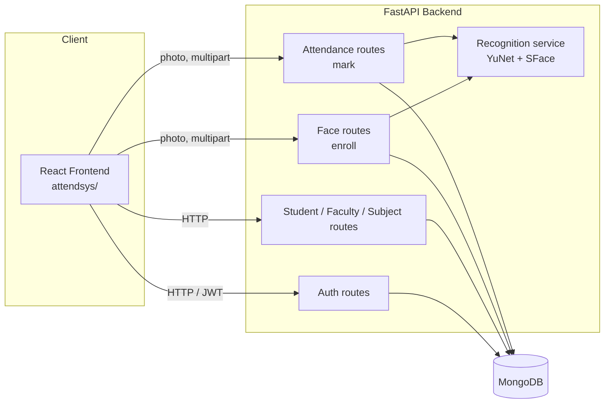
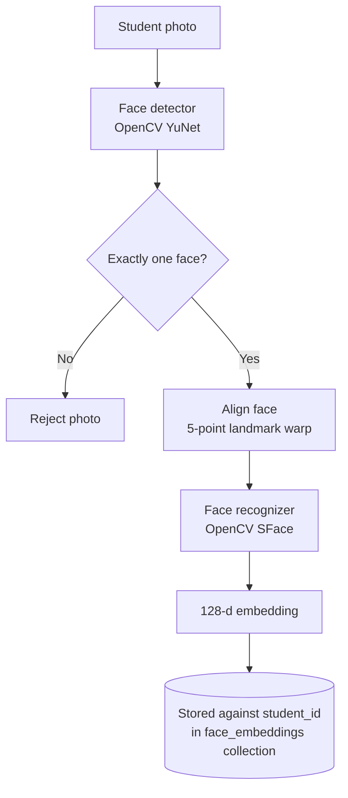
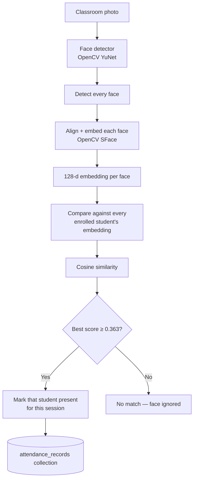

*Placeholders in square brackets — college name, group members, supervisor, dates — are left for you to fill in; everything else reflects the actual codebase.*

# Smart Attendance System Using Face Recognition

**A Project Proposal**

Submitted to
**[Department Name], [College Name]**
*Affiliated to Pokhara University*

In partial fulfillment of the requirements for the degree of
**[Bachelor of Computer Application / Bachelor of Information Technology]**

---

**Submitted by:**
[Student Name 1] — [Roll No.]
[Student Name 2] — [Roll No.]
[Student Name 3] — [Roll No.]

**Submitted to:**
[Supervisor Name], Department of [Department Name]

**Date:** [Submission Date]

---

## 1. Introduction

### 1.1 Background

Attendance tracking is a routine but essential part of running any classroom — it feeds directly into eligibility for exams, scholarship criteria, and day-to-day accountability between students and faculty. In most colleges this is still done manually: a physical roll call, or a paper/register sign-off, repeated in every class, every day, by every faculty member.

Manual attendance has three recurring problems: it consumes several minutes of every class period, it is trivial to falsify (proxy attendance — one student answering for another), and the resulting records are hard to aggregate for reporting (e.g., "which students are below 75% for this subject this semester?") without extra manual work.

**Smart Attendance System (DAS)** addresses this by letting a faculty member take a single photo of the classroom; the system detects every face in that photo, matches each one against a pre-enrolled database of student face embeddings, and records attendance automatically — turning a multi-minute manual process into a single photo capture.

### 1.2 Problem Statement

- Manual roll-call is slow and repeats a fixed cost every single class period.
- Manual/paper-based systems are vulnerable to proxy attendance.
- Attendance data trapped in paper registers is difficult to aggregate into per-student, per-subject reports (e.g., low-attendance alerts).
- Existing biometric alternatives (fingerprint scanners, RFID cards) require dedicated hardware per classroom and a physical touch/tap per student, which does not scale well to a "walk in and be marked present" experience for a full class in one action.

Face recognition, run against a single classroom photo, is proposed as a contactless, hardware-light alternative: the only "device" needed is a camera already present on any laptop or phone.

## 2. Objectives

1. To design and implement a web-based attendance system with distinct **Student**, **Faculty**, and **Admin** roles.
2. To implement a **face enrollment** module: one photo per student, converted into a numeric face embedding and stored against that student's record.
3. To implement **automatic attendance marking**: one classroom photo, converted into a list of present students by matching detected faces against enrolled embeddings.
4. To persist all attendance events in a database in a form that supports later reporting (per-subject, per-session records).
5. To provide faculty a simple, camera-based interface for triggering attendance capture during a live class.

## 3. Scope and Limitation

### 3.1 Scope

- Role-based accounts for Student, Faculty, and Admin, backed by JWT authentication.
- CRUD management of students, faculty, and subjects.
- Face enrollment from a single clear photo per student.
- Attendance marking from a single classroom photo containing multiple students.
- Persistent attendance records queryable by session.

### 3.2 Limitations

- Recognition accuracy depends on photo quality — lighting, camera angle, face occlusion (masks, extreme angles) all reduce match confidence.
- The system is **not spoof-proof**: it does not currently include liveness detection, so a printed photo held up to the camera could theoretically be matched. This is acceptable for a controlled classroom setting under faculty supervision but is flagged as a known limitation, not a solved problem.
- Threshold-based matching can, at the margins, produce a false accept (matching the wrong enrolled student) or false reject (failing to match an enrolled student) — the system reports a confidence score with every match so borderline cases can be manually reviewed.
- Requires a device with a working camera and a connection to the backend server; there is no offline mode.
- Designed and tested for classroom-sized groups (tens of students in a single photo), not stadium-scale crowds.

## 4. Methodology

The system was built incrementally: the data model and role-based CRUD layer (students, faculty, subjects, auth) were implemented first, followed by the computer-vision pipeline (face detection, embedding, matching) once the storage layer it depends on was already working and testable.

### 4.1 Requirement Analysis

**Functional Requirements**

| # | Requirement |
|---|---|
| FR1 | A user can register and log in with a role (student / faculty / admin); passwords are hashed, sessions use JWT. |
| FR2 | An admin/faculty can create, view, update, and delete student, faculty, and subject records. |
| FR3 | A student's face can be enrolled from a single photo — the system rejects the photo if it does not contain exactly one clear face. |
| FR4 | A faculty member can submit a classroom photo; the system detects every face in it. |
| FR5 | Each detected face is compared against every enrolled student's stored embedding, and matched if similarity is above a fixed confidence threshold. |
| FR6 | A matched student is recorded as present for the given subject/session; the same student is not recorded twice for the same session. |
| FR7 | Attendance records for a session can be retrieved. |

**Non-Functional Requirements**

| # | Requirement |
|---|---|
| NFR1 | **Security** — passwords are never stored in plaintext (bcrypt); API access uses signed JWTs. |
| NFR2 | **Performance** — the face detection/recognition models are loaded once at server startup, not per-request, so individual capture requests stay fast. |
| NFR3 | **Maintainability** — the backend is layered (routes → services → models/schemas), so the database and the HTTP layer can each change independently. |
| NFR4 | **Usability** — attendance capture is a single "open camera → take photo → submit" action for the faculty member, no manual roll-call needed. |
| NFR5 | **Portability** — runs on any device with a modern browser and a camera; no proprietary hardware. |

### 4.2 Feasibility Study

- **Technical feasibility**: every component is built on mature, freely available open-source software (FastAPI, MongoDB, OpenCV, React) already proven to run correctly on the development machine — the face-detection/recognition pipeline described in Section 6 has been implemented and verified end-to-end against a live server and a live database, not just designed on paper.
- **Operational feasibility**: the only new action required of a faculty member is opening a camera view and pressing "capture" — no new hardware, no per-student enrollment device beyond a normal camera.
- **Economic feasibility**: all software used is free and open-source (no licensing cost); the only hardware requirement is a standard device with a camera, which classrooms/faculty already have access to.
- **Schedule feasibility**: scoped to fit a sixth-semester project timeline — see the tentative schedule in Section 8.

### 4.3 System Design

**High-level architecture**

**Enrollment pipeline** (one photo per student, run once)

**Attendance pipeline** (one classroom photo per capture)

**Core data collections (MongoDB)**

| Collection | Key fields |
|---|---|
| `users` | fullname, email, hashed_password, role |
| `students` | student_id, fullname, email, section, semester |
| `faculty` | faculty_id, fullname, email, subjects_assigned |
| `subjects` | subject_code, subject_name, credit_hour, faculty_id |
| `face_embeddings` | student_id, embedding_vector (128 floats), model_name |
| `attendance_records` | record_id, student_id, subject_code, session_id, is_present, marked_by, confidence, timestamp |
| `capture_sessions` | session_id, subject_code, triggered_by, frames_captured, total_recognized — one row per distinct capture session, used to compute how many classes were *held* for a subject |

### 4.4 Tools and Technologies

| Layer | Technology |
|---|---|
| Backend framework | FastAPI (Python) |
| Database | MongoDB, accessed via PyMongo |
| Authentication | JWT (`python-jose`) + bcrypt password hashing |
| Face detection | OpenCV `FaceDetectorYN` (YuNet model) |
| Face recognition | OpenCV `FaceRecognizerSF` (SFace model), 128-d embeddings, cosine similarity |
| Frontend | React + React Router, Vite, Tailwind CSS |
| Version control | Git / GitHub |

## 5. Implementation

The system is implemented in two layers that were built in sequence:

1. **CRUD/data layer** — role-based auth, and student/faculty/subject management, each following the same pattern: a FastAPI route validates the request against a Pydantic schema, hands it to a service function, which reads/writes a MongoDB collection through a plain Python model class.
2. **Face recognition layer** — built on top of the storage layer above once it was working. Two endpoints do the actual computer-vision work:
   - `POST /faces/enroll` — accepts a student's photo, runs it through the detector, rejects it unless exactly one face is found, computes its 128-d SFace embedding, and stores it via the same storage code the CRUD layer already used.
   - `POST /attendance/mark` — accepts a classroom photo, detects every face in it, computes an embedding for each, compares each against every enrolled student via cosine similarity, and writes one attendance record per match (skipping students already marked present for that session, so re-running a capture is safe).

Both endpoints, and the matching logic between them, have been tested end-to-end against a running server and a live database: enrolling a real face photo, then submitting a classroom-style photo containing that same face and confirming a correct match and a written attendance record; confirming a repeated capture does not create duplicate records; and confirming a multi-face photo is correctly rejected during enrollment (which requires exactly one face).

3. **Frontend integration** — the React frontend's role-based dashboards (Student, Faculty, Admin), including the live-camera capture component, are now connected to the live backend rather than running on placeholder data:
   - **Login** works for all three roles against the same `users` collection (an admin is simply a `users` document with `role: "admin"` — no separate table). Creating a student or faculty record now also creates its login account automatically, with a system-generated default password (`{id}@123`) shown once to the admin at creation time.
   - **Admin** can create student and faculty accounts, and enroll a student's face from a single live-camera photo.
   - **Faculty** pick one of their assigned subjects and capture a classroom photo; attendance is written against a session derived from the subject and the current date, so repeated captures the same day accumulate rather than duplicate.
   - **Student** views their own attendance — per-subject held/attended/percentage and a full history log — computed from their `attendance_records`, cross-referenced against a `capture_sessions` log that now records every time a class was captured (previously an unused collection).

## 6. Expected Outcome

A working prototype, connected end-to-end through a real browser UI, that demonstrates:
- Any of the three roles logging in with a real account and password.
- An admin creating student and faculty accounts (each with a system-generated password) and enrolling a student's face by photo.
- A faculty member submitting one photo of a classroom and having every recognizable, enrolled student automatically marked present.
- A student viewing their own attendance — per-subject percentage and full history — computed from real attendance records rather than placeholder data.
- Attendance records that persist per subject and per session, aggregated into per-student, per-subject percentages.

## 7. Future Enhancements

- Server-side route protection (role-checked JWT dependencies) — every route is currently reachable by anyone who knows the URL; access is gated only by the frontend's client-side routing, not enforced by the backend itself.
- A live class "session" concept (start/end, tied to a specific time slot) rather than one session per subject per calendar day.
- Absentee rostering: show the full class roster per session (present **and** absent), not just matched students.
- A formal student↔subject enrollment link, so a subject a student has zero attendance in still shows up as 0% rather than being omitted from their summary entirely.
- Low-attendance alerts (e.g., flag students under 75% for a subject) — currently still placeholder data on the faculty dashboard.
- Basic liveness/anti-spoofing checks before accepting an enrollment or attendance photo.
- Persisting the manual roll-call override (currently a local-only UI toggle with no backend endpoint behind it).

## 8. Tentative Time Schedule

*(Adjust weeks/dates to your actual semester calendar.)*

| Phase | Week(s) |
|---|---|
| Requirement gathering & proposal | 1–2 |
| System design (architecture, data model) | 3–4 |
| Backend: auth + CRUD (students/faculty/subjects) | 5–6 |
| Face detection & recognition pipeline | 7–9 |
| Frontend integration with live endpoints | 10–11 |
| Testing & bug fixing | 12–13 |
| Documentation & final defense preparation | 14 |

## 9. References

1. FastAPI Documentation — https://fastapi.tiangolo.com
2. OpenCV Documentation — https://docs.opencv.org
3. MongoDB Documentation — https://www.mongodb.com/docs
4. React Documentation — https://react.dev
5. Zhong, Y., Deng, W., Hu, J., Zhao, D., Li, X., & Wen, D. (2021). *SFace: Sigmoid-Constrained Hypersphere Loss for Robust Face Recognition*. IEEE Transactions on Image Processing.
6. OpenCV Zoo — pretrained YuNet (face detection) and SFace (face recognition) models used in this project: https://github.com/opencv/opencv_zoo
